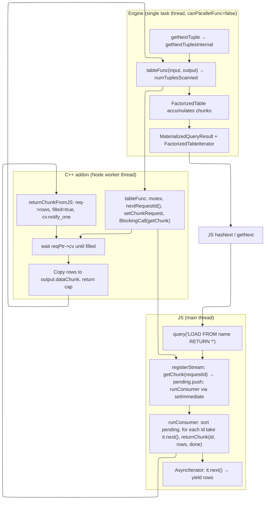

# LOAD FROM stream: Execution Chain (reference & recommendations)

## Execution chain diagram

---

## Useful observations

- **Order**: With `canParallelFunc = false`, one engine thread calls `tableFunc` sequentially. Request IDs are assigned under mutex; JS `runConsumer` sorts `pending` and serves chunks by `requestId`, so iterator order is preserved.
- **End of stream**: Engine calls `tableFunc` until it returns 0. JS sends `returnChunk(id, [], true)` when the iterator is done; C++ returns 0 and the engine stops. No extra call after 0.
- **getNext contract**: Core `getNext()` throws if `!hasNext()`. Addon always checks `hasNext()` before `getNext()` and returns `null` when exhausted so that JS API matches `getNext(): Promise<Record | null>`.

---

## Recommendations for the future

1. **Keep `canParallelFunc = false`** for the node stream table function. Enabling parallelism would require a deterministic merge of chunks by requestId on the engine side; until then, single-thread keeps order and avoids subtle bugs.
2. **Any new code path that reads rows** (e.g. another language binding or helper) must guard with `hasNext()` before `getNext()`; core will throw otherwise.
3. **Mutex in `tableFunc`**: Currently redundant with single-thread execution but harmless. If parallelism is ever introduced, either remove the mutex and solve ordering in the engine or keep it and document that the stream source is intentionally serialized.
4. **Tests**: Prefer iterating with `hasNext()` + `getNext()` and asserting `getNext()` returns `null` exactly when `hasNext()` becomes false, to lock the contract (see `test_query_result.js`).
5. **Rebuild and full test run** (e.g. `register_stream` + `query_result`) after any change in the addon or engine table function path.
